# muwu(木坞)

## 介绍
本项目为微服务基础架构主要完成的功能、用户管理、角色管理、菜单管理、权限管理、鉴权管理、链路中心、日志中心、监控大屏......

## 演示环境
http://122.112.246.245/

## 技术栈
lua  
Oauth2  
dubbo  
openresty  
spring boot  
elasticsearch  
kafka  
......  

## 软件架构
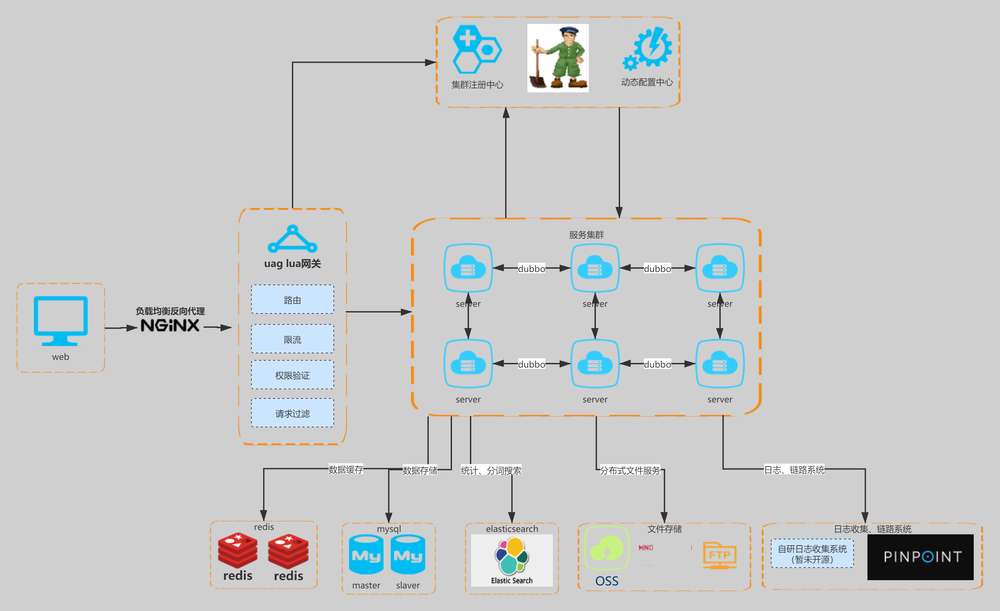

## 系统截图
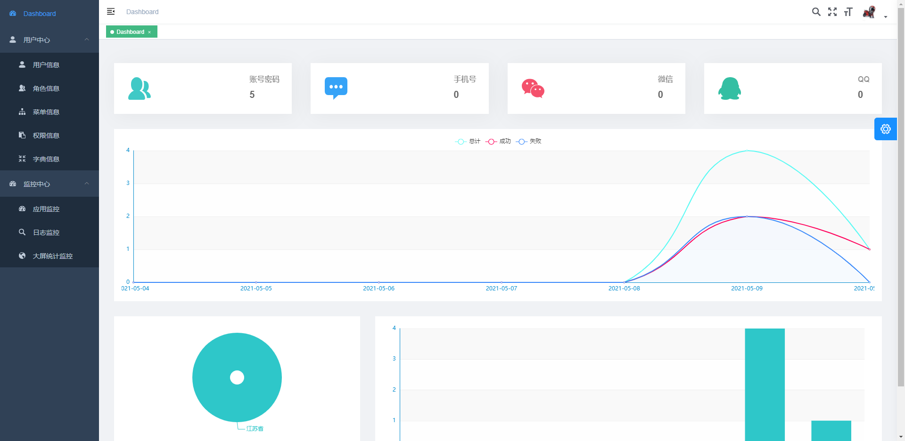
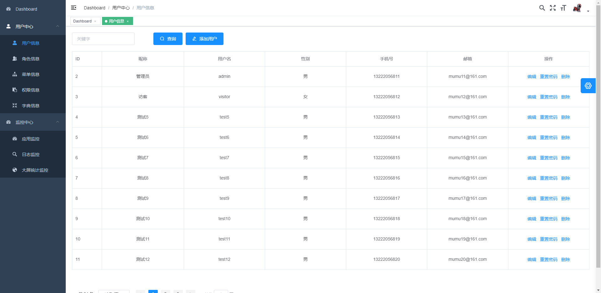
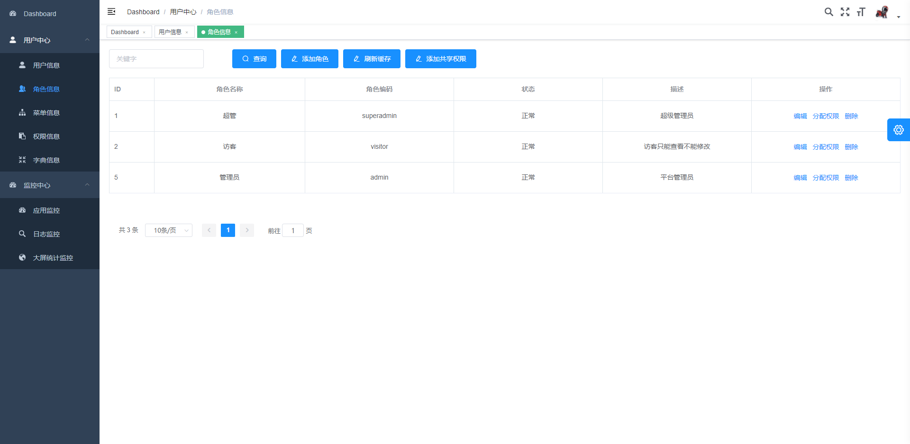
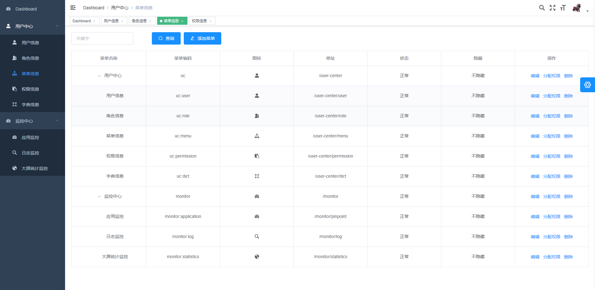
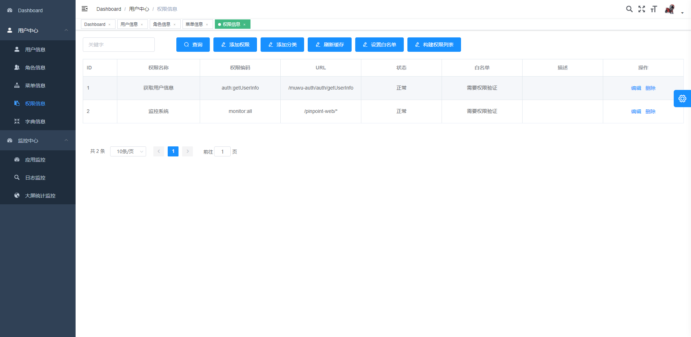
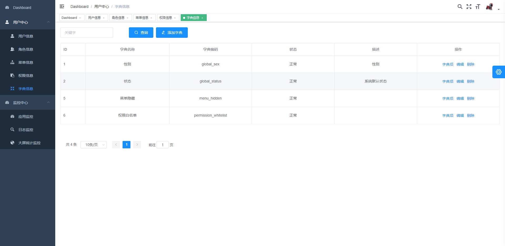
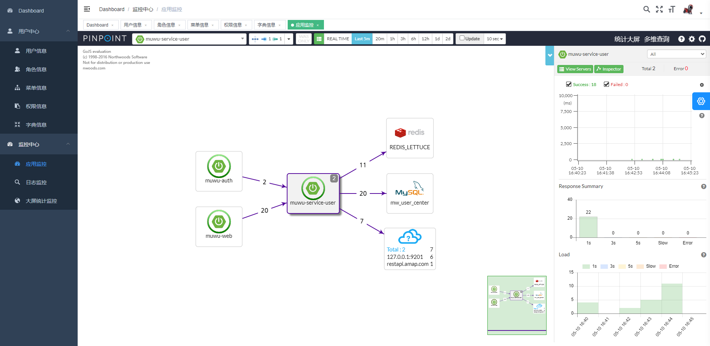
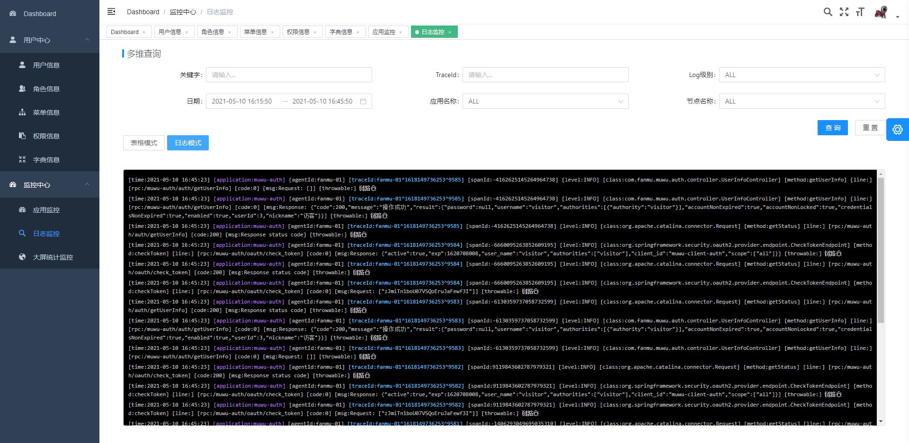
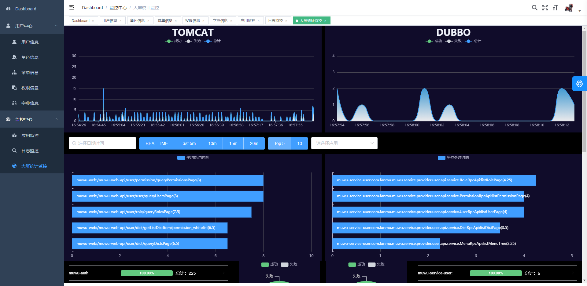
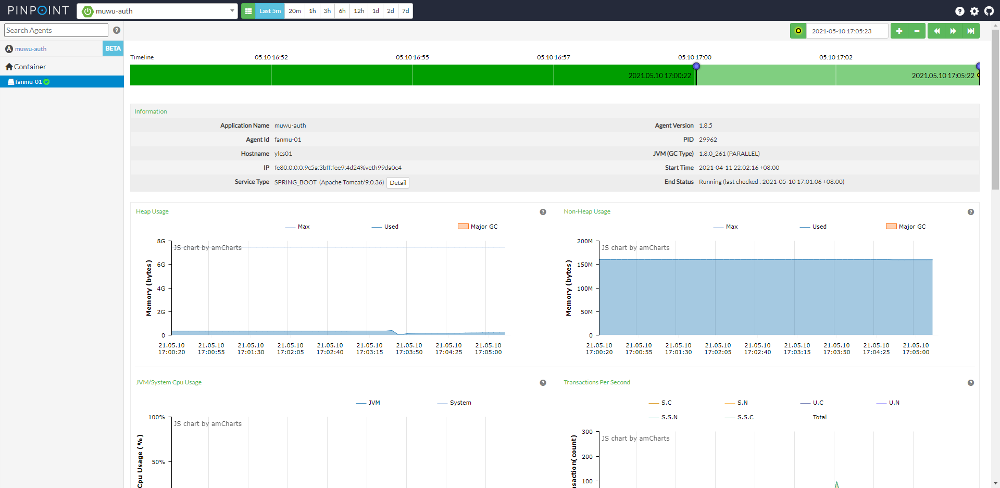
